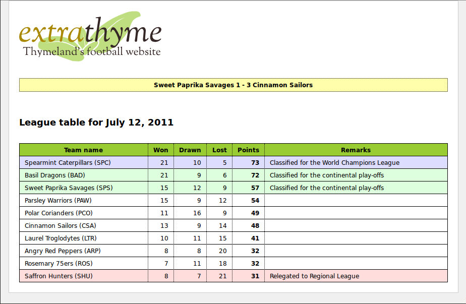

# 创建我们自己的方言

## Extrathyme: 麝香草大陆的足球联赛网站

足球是麝香草大陆最流行的运动。每个赛季有10对参加联赛，主办方请为我们为它创建一个叫做"Extrathyme"的网站。

这个网站将非常简单，就是一个表格。

- 队名
- 胜平负的场次，以及获得的总分
- 备注，该队伍当前所处的位置，下赛季保级还是升入高级别联赛

然后在表格上显示一个广告和最近比赛的比分。



我们将使用HTML5 ,Spring MVC 和Spring标准方言来完成我们的应用程序。然后我们扩展Thymeleaf去创建一个 计分方言。它包含：

- ```score:remarkforposition``` 属性，输出一个国际化的文本备注列到表格中，这个文本解释了当前队伍的位置，是否符合参加世界锦标赛的条件，是否可以进行附加赛，或者降级到低级联赛。
- ```score:classforposition```属性 根据备注设置颜色，蓝色背景表示可以参加世界锦标赛，绿色可以参加附加赛，红色会降级.
-  ```score:headlines``` 标签用于显示一个最近比赛的黄色的框到顶部。这个标签需要支持一个order属性 ：random:为了随机显示最近的比赛 latest显示最近的比赛，默认只显示最近的比赛。我们的标签看起来像这样，使用了th和score属性：

		<!DOCTYPE html>
		<html xmlns:th="http://www.thymeleaf.org" xmlns:score="http://thymeleafexamples">

		  <head>
		    <title>extraThyme: Thymeland's football website</title>
		    <meta http-equiv="Content-Type" content="text/html; charset=UTF-8" />
		    <link rel="stylesheet" type="text/css" media="all"
		          href="../../css/extrathyme.css" th:href="@{/css/extrathyme.css}"/>
		  </head>

		  <body>

		    <div>
		      
		    </div>

		    <score:headlines order="random" />

		    <div class="leaguetable">

		      <h2 th:text="#{title.leaguetable(${execInfo.now.time})}">
		        League table for 07 July 2011
		      </h2>
		      
		      <table>
		        <thead>
		          <tr>
		            <th th:text="#{team.name}">Team</th>
		            <th th:text="#{team.won}" class="matches">Won</th>
		            <th th:text="#{team.drawn}" class="matches">Drawn</th>
		            <th th:text="#{team.lost}" class="matches">Lost</th>
		            <th th:text="#{team.points}" class="points">Points</th>
		            <th th:text="#{team.remarks}">Remarks</th>
		          </tr>
		        </thead>
		        <tbody>
		          <tr th:each="t : ${teams}" score:classforposition="${tStat.count}">
		            <td th:text="|${t.name} (${t.code})|">The Winners (TWN)</td>
		            <td th:text="${t.won}" class="matches">1</td>
		            <td th:text="${t.drawn}" class="matches">0</td>
		            <td th:text="${t.lost}" class="matches">0</td>
		            <td th:text="${t.points}" class="points">3</td>
		            <td score:remarkforposition="${tStat.count}">Great winner!</td>
		          </tr>
		          <!--/*-->
		          <tr>
		            <td>The First Losers (TFL)</td>
		            <td class="matches">0</td>
		            <td class="matches">1</td>
		            <td class="matches">0</td>
		            <td class="points">1</td>
		            <td>Little loser!</td>
		          </tr>
		          <tr>
		            <td>The Last Losers (TLL)</td>
		            <td class="matches">0</td>
		            <td class="matches">0</td>
		            <td class="matches">1</td>
		            <td class="points">0</td>
		            <td>Big loooooser</td>
		          </tr>
		          <!--*/-->
		        </tbody>
		      </table>

		    </div>

		  </body>

		</html>
	
请注意，我们增加了第二和第三行到表中，由解析器的注释包围<！ - /*... */ - >，这样我们可以再浏览器打开时显示一个近似的原型。

## 根据队伍的排名设置CSS样式

我们将首先开放一个属性处理器 ClassForPositionAttrProcessor，为了更方便我们将继承自Thymeleaf  提供的抽象类AbstractAttributeModifierAttrProcessor.

此抽象类面向创建那些需要修改或设置主标签的属性值的处理器，这正是我们需要的（我们讲为<TR>设置一个class属性)。


下面是我们的代码:

			public class ClassForPositionAttrProcessor  extends AbstractAttributeModifierAttrProcessor {

			    public ClassForPositionAttrProcessor() {
			        super("classforposition");
			    }

			    public int getPrecedence() {
			        return 12000;
			    }

			    @Override
			    protected Map<String, String> getModifiedAttributeValues(
			            final Arguments arguments, final Element element, final String attributeName) {

			        final Configuration configuration = arguments.getConfiguration();

			        /*
			         * 获得属性值
			         */
			        final String attributeValue = element.getAttributeValue(attributeName);

			        /*
			         * 获得Thymeleaf的标准表达式解析器 			         */
			        final IStandardExpressionParser parser =
			                StandardExpressions.getExpressionParser(configuration);

			        /*
			         * 以一个标准Thymeleaf表达式解析属性值			         */
			        final IStandardExpression expression =
			                parser.parseExpression(configuration, arguments, attributeValue);

			        /*
			         * 执行刚才解析到的表达式
			         */
			        final Integer position =
			                (Integer) expression.execute(configuration, arguments);

			        /*
			         * 获取联赛表格中对应该位置的备注信息			         */
			        final Remark remark = RemarkUtil.getRemarkForPosition(position);

			        /*
			         * 应用对应的CSS样式到元素中			         		*/
			        final Map<String,String> values = new HashMap<String, String>();
			        if (remark != null) {
			            switch (remark) {
			                case WORLD_CHAMPIONS_LEAGUE:
			                    values.put("class", "wcl");
			                    break;
			                case CONTINENTAL_PLAYOFFS:
			                    values.put("class", "cpo");
			                    break;
			                case RELEGATION:
			                    values.put("class", "rel");
			                    break;
			            }
			        }

			        return values;
			    }

			    @Override
			    protected ModificationType getModificationType(final Arguments arguments, 
			            final Element element, final String attributeName, 
			            final String newAttributeName) {

			        // 万一该元素已经设置了Class属性，我们将把我们的新值拼接到后面（用空格隔开），或者简单的取代他
			        return ModificationType.APPEND_WITH_SPACE;
			    }

			    @Override
			    protected boolean removeAttributeIfEmpty(final Arguments arguments,
			            final Element element, final String attributeName, 
			            final String newAttributeName) {

			        // 如果算出来的class属性是空则根本不显示出来			        return true;
			    }

			    @Override
			    protected boolean recomputeProcessorsAfterExecution(final Arguments arguments,
			            final Element element, final String attributeName) {

			        // 当这个元素被执行完成后不需要再重新计算
			        return false;
			    }
			}
			
如你所见，在这种情况下我们使用便利的抽象类没有直接对DOM树进行修改，而只需要创建并返回一个需要设置到标签中设置的一组新值的Map。

非常重要的一点，我们创建的这些属性支持标准语法的表达式运算（在标准方言和Spring  标准方言中都用到了），我们可以这样设置变量 ${var} , #{messageKey} ,使用条件表达式等等。 我们在我们的模板中这样使用。


	<tr th:each="t : ${teams}" score:classforposition="${tStat.count}">

为了计算这些表达式（或者叫做Thymeleaf标准表达式），首先我们需要获取标准表达式的解析器，然后解析属性值，然后计算解析后的表达式。	

	final IStandardExpressionParser parser =
	        StandardExpressions.getExpressionParser(configuration);

	final IStandardExpression expression =
	        parser.parseExpression(configuration, arguments, attributeValue);

	final Integer position =
	        (Integer) expression.execute(configuration, arguments);


## 显示一个国际化备注
下一件事情是创建一个属性解析器，去显示备注的文本。这个与ClassForPositionAttrProcessor比较相似，但是又一些重要的不同点:

我们将不会设置一个标签属性到主标签，也不会和th:text一样设置标签的内容。
我们需要访问从我们的代码访问国际化消息系统显示选定的locale的相应消息。这次我们将使用另外一个不同的抽象类AbstractTextChildModifierAttrProcessor，特别设计用于设置标签的文本内容。我们的代码如下：

	public class RemarkForPositionAttrProcessor
	        extends AbstractTextChildModifierAttrProcessor {

	    public RemarkForPositionAttrProcessor() {
	        super("remarkforposition");
	    }

	    public int getPrecedence() {
	        return 12000;
	    }

	    @Override
	    protected String getText(
	            final Arguments arguments, final Element element, final String attributeName) {

	        final Configuration configuration = arguments.getConfiguration();

	        /*
	         * 获取属性值
	         */
	        final String attributeValue = element.getAttributeValue(attributeName);

	        /*
	         * 获取Thymeleaf 标准表达式解析器
	         */
	        final IStandardExpressionParser parser =
	                StandardExpressions.getExpressionParser(configuration);

	        /*
	         * 解析属性值用于Thymeleaf 标准表达式
	         */
	        final IStandardExpression expression =
	                parser.parseExpression(configuration, arguments, attributeValue);

	        /*
	         * 执行刚才解析出的表达式
	         */
	        final Integer position =
	                (Integer) expression.execute(configuration, arguments);

	        /*
	         * 从联赛表获取对应位置的备注
	         */
	        final Remark remark = RemarkUtil.getRemarkForPosition(position);

	        /*
	         * 如果没有备注显示空
	         */
	        if (remark == null) {
	            return "";
	        }

	        /*
	         *  消息应该是国际化的，所以我们让模板引擎处理消息
	         * 'remarks.{REMARK}' (e.g. 'remarks.RELEGATION'). 不需要参数	         *.
	         */
	        return getMessage(arguments, "remarks." + remark.toString(), new Object[0]);

	    }

	}
	

我们使用这段代码访问国际化消息系统：

			return getMessage(arguments, "remarks." + remark.toString(), new Object[0]);

事实上这不是唯一的方式。AbstractProcessor 提供了3个方法从属性 处理器获取国际化消息。以下2个方法从模板的消息文件和控制器的消息文件获取：

	protected String getMessageForTemplate(
	        final Arguments arguments, final TemplateResolution templateResolution,
	        final String messageKey, final Object[] messageParameters);

	protected String getMessageForProcessor(
	        final Arguments arguments, final String messageKey,
	        final Object[] messageParameters);
	        
	getMessageForTemplate(...) 使用模板引擎当前注册的外部机制去查询期望的消息，例如：uses the Template Engine’s currently registered externalization mechanisms to look for the desired message. For example:

在一个Spring应用程序中，我们可以使用了一个指定的Message Resolver 来查询Spring的注册到应用程序中的MessageSource对象。当不在一个Spring应用程序中时，我们可能会使用Thymeleaf的标准Message Resolver去查找与当前模板同名的.properties文件。

getMessageForProcessor(...)使用组件化的消息解决方案，如果你愿意你可以自己为一个方言进行封装。该机制包括在允许标签和属性的处理器来指定自己的消息，无论方言用在哪个应用程序。他们读取与处理器（或者其父类）同一个包下的.properties文件。例如：我们例子中的 thymeleafexamples.extrathyme.dialects.score  包可能包含以下内容。

- RemarkForPositionAttrProcessor.java: 属性处理器
- RemarkForPositionAttrProcessor_en_GB.properties: 用于英国英语的的资源文件
- RemarkForPositionAttrProcessor_en.properties: 用于其他国家的语言的资源文件
- RemarkForPositionAttrProcessor.properties: 默认的资源文件

最后，这是第三个方法，我们用在我们的代码中的方法:

	protected String getMessage(
	        final Arguments arguments, final TemplateResolution templateResolution,
	        final String messageKey, final Object[] messageParameters);
	        
getMessage(...)的行为相当于以上两个方法的组合。首先他尝试通过模板资源文件(在应用程序中定义的资源文件)去找到需要的消息 ，如果没有找到就从处理器的资源文件中查找。这样应用如果需要的话应用程序可以覆盖在方言处理器中定义的消息。

## 用于显示头条的元素处理器 

第三个也是最后一个我们将要实现的处理器是一个元素（标签）处理器。正如他的名字一样元素处理器由元素的名字触发而不是元素的属性名字。相对属性处理器他有一个优点也有一个劣势。

**优势**: 元素可以包含多个属性，这样你的元素处理器可以接受更多更复杂的配置参数。
**劣势**: 定制化的元素或标签无法被浏览器识别，如果你正在开发的是一个web应用程序，你可能不得不牺牲Thymeleaf最有趣的功能: 以静态原型的方式显示模板（我们称为原生模板）

这个处理器将由org.thymeleaf.processor.element.AbstractElementProcessor进行扩展，但是和属性处理器一样，我们不直接从AbstractElementProcessor扩展，而是从Thymeleaf提供的便利的抽象类AbstractMarkupSubstitutionElementProcessor进行扩展。这个基础的元素处理器用于，在模板处理时简单的生成DOM节点替换主标签。	
	代码如下:

	public class HeadlinesElementProcessor extends AbstractMarkupSubstitutionElementProcessor {

	    private final Random rand = new Random(System.currentTimeMillis());

	    public HeadlinesTagProcessor() {
	        super("headlines");
	    }

	    public int getPrecedence() {
	        return 1000;
	    }

	    @Override
	    protected List<Node> getMarkupSubstitutes(
	            final Arguments arguments, final Element element) {

	        /*
	        * 获取Spring应用程序的上下文
	         */
	        final ApplicationContext appCtx =
	            ((SpringWebContext)arguments.getContext()).getApplicationContext();

	        /*
	        * 从应用程序上下文获取HeadlineRepository的Bean，查询当前的头条信息	         */
	        final HeadlineRepository headlineRepository = 
	                appCtx.getBean(HeadlineRepository.class);
	        final List<Headline> headlines = headlineRepository.findAllHeadlines();

	        /*
	        * 读取标签的order属性值，这个可选的属性用于允许我们随机显示头条信息还是只显示最新的
	         */
	        final String order = element.getAttributeValue("order");

	        String headlineText = null;
	        if (order != null && order.trim().toLowerCase().equals("random")) {
	            // Order is random
	            final int r = this.rand.nextInt(headlines.size());
	            headlineText = headlines.get(r).getText();
	        } else {
	            // Order is "latest", only the latest headline will be shown
	            Collections.sort(headlines); headlineText = 
	                    headlines.get(headlines.size() - 1).getText();
	        }

	        /*
	         * 创建替换主标签的DOM结构
	         * 头条内容将显示到<div>标签内，所以我们首先创建他然后将文本节点添加进去	         */
	        final Element container = new Element("div");
	        container.setAttribute("class", "headlines");

	        final Text text = new Text(headlineText);
	        container.addChild(text);

	        /*
	        * 抽象类IAttrProcessor实现我们返回一个节点的list，然后这些list会替换掉主标签
	         */
	        final List<Node> nodes = new ArrayList<Node>();
	        nodes.add(container); return nodes;

	    }

	}
	
这里没有太多的新东西，除了我们访问了Spring的ApplicationContext为了获取一个Bean（HeadlineRepository).

还要注意我们可以像这样访问其他DOM元素一样访问定制的标签的order属性：


		final String order = element.getAttributeValue("order");

## 声明整个方言
为了完成方言我们还差最后最后一步，定义方言类本省。

方言类必须实现org.thymeleaf.dialect.IDialect接口，我们再次使用便利的抽象类，这样我们可以只实现我们需要的方法，其他的则使用默认（空值）。

这是代码，很简单：

	public class ScoreDialect extends AbstractDialect {

    /*
     * Default prefix: this is the prefix that will be used for this dialect
     * unless a different one is specified when adding the dialect to
     * the Template Engine.
     * 默认的用于该方言的前缀。可以再添加到模板引擎时进行了制定。
     */
    public String getPrefix() {
        return "score";
    }

    /*
     * 定义了2个属性处理器 'classforposition' 和
     * 'remarkforposition'. 以及一个元素处理器'headlines'
     */
    @Override
    public Set<IProcessor> getProcessors() {
        final Set<IProcessor> processors = new HashSet<IProcessor>();
        processors.add(new ClassForPositionAttrProcessor());
        processors.add(new RemarkForPositionAttrProcessor());
        processors.add(new HeadlinesElementProcessor());
        return processors;
    }

}

一旦我们的方言创建好我们需要在我们的模板引擎定义它。我们将使用 additionalDialects 属性来添加到Spring 标准方言中。


来看看如何进行配置:

<bean id="templateEngine"
      class="org.thymeleaf.spring4.SpringTemplateEngine">
  <property name="templateResolver" ref="templateResolver" />
  <property name="additionalDialects">
    <set>
      <bean class="thymeleafexamples.extrathyme.dialects.score.ScoreDialect" />
    </set>
  </property>
</bean>

好了，完成了，我们的联赛表格将按照我们希望的方式显示出来了。